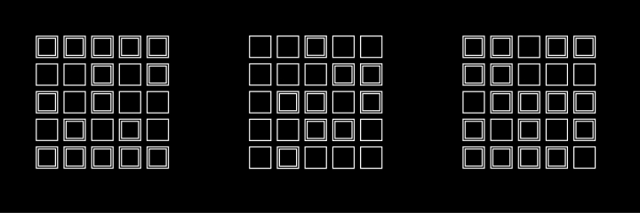
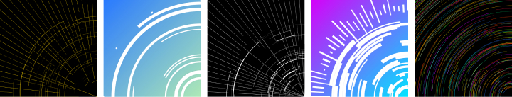
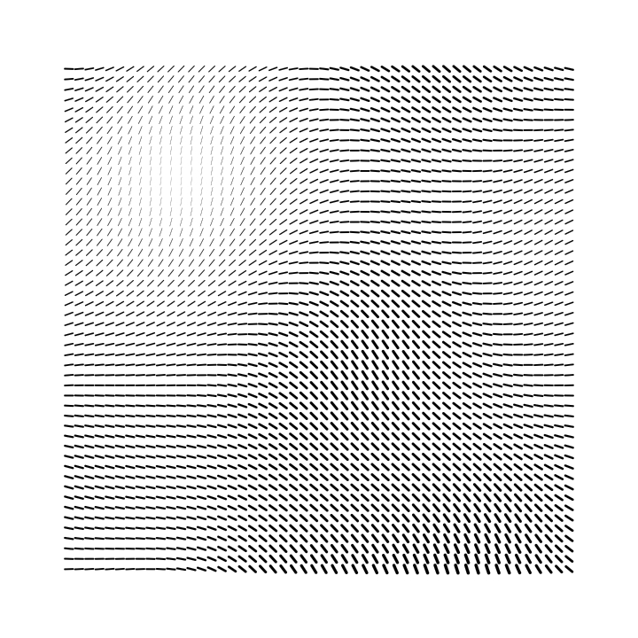
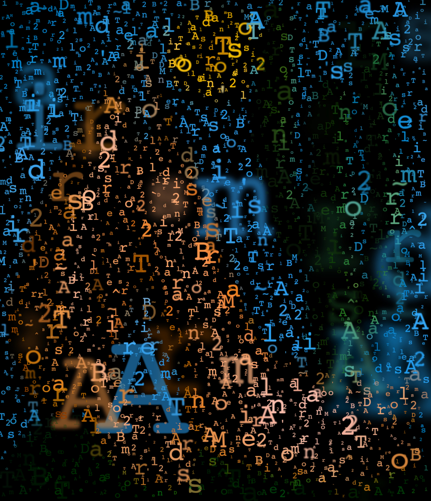
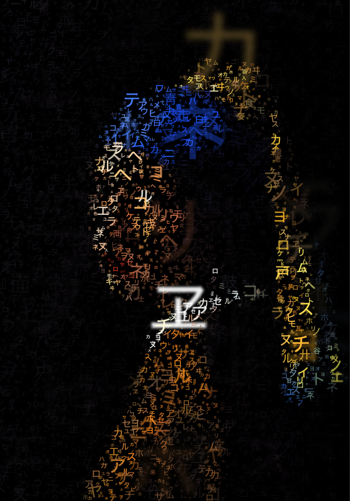
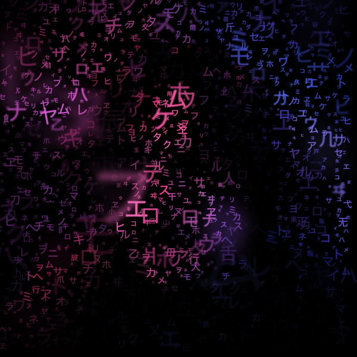
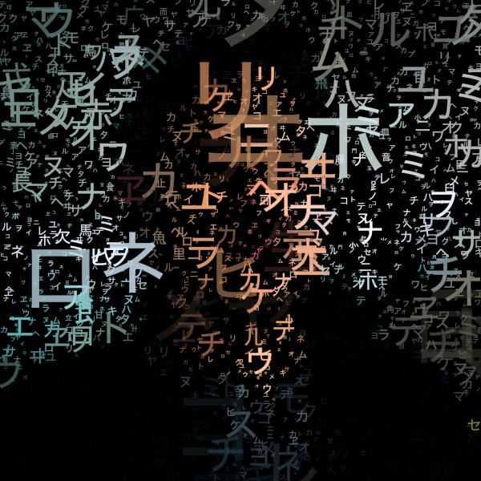
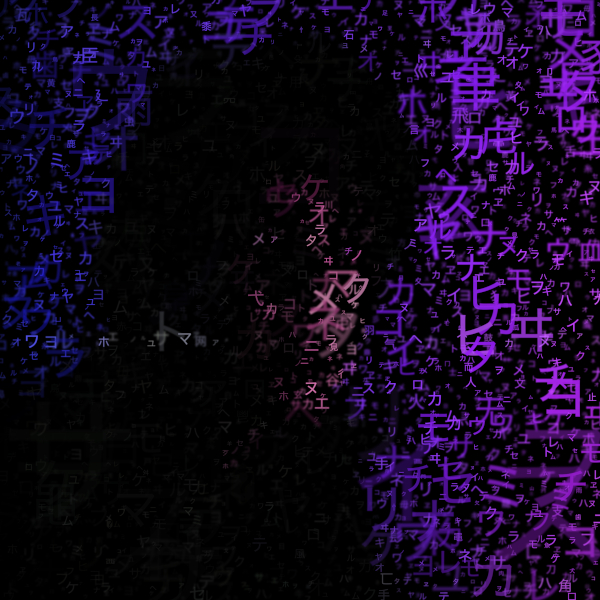

# Domestika: Creative Coding (bruno.imbrizi)

| Unit 2 | Unit 3 | Unit 4 | Unit 5 | Unit 6 |
| ------------- | ------------- | ------------- | ------------- | ------------- |
| [Fundamentals](#unit-2---fundamentals) | [Sketch Transform](#unit-3---sketch-transform) | [Sketch Agents](#unit-4---sketch-agents) | [Sketch Noise](#unit-5---sketch-noise) | [Sketch Type](#unit-6---sketch-type) |

[Canvas-Sketch Documentation](#canvas-sketch)

- [Quick Start](#quick-start)
- [Canvas-Sketch Example](#code-example)

## Unit 2 - Fundamentals




## Unit 3 - Sketch Transform




## Unit 4 - Sketch Agents


## Unit 5 - Sketch Noise



## Unit 6 - Sketch Type

|  |  |
| ------------- | ------------- |

[Course of Creative Coding with Javascript by Bruno Imbrizi on Domestika.](https://www.domestika.org/pt/courses/2729-programacao-criativa-produza-pecas-visuais-com-javascript)
<p align="center">
  
</p>

----

# canvas-sketch

`canvas-sketch` is a loose collection of tools, modules and resources for creating generative art in JavaScript and the browser.

<!-- - :sparkles: Website (not yet public) -->

- :closed_book: [Documentation](https://github.com/mattdesl/canvas-sketch/blob/master/docs/README.md)

- :wrench: [Examples](https://github.com/mattdesl/canvas-sketch/blob/master/examples)

#

<p align="center">
  <sub>example of <code>canvas-sketch</code> running in Chrome</sub>
</p>

<p align="center">
  <sub>↓</sub>
</p>

<p align="center">
  
</p>

### Quick Start

To jump directly into `canvas-sketch`, try the following terminal commands with `node@8.x` and `npm@5.x` or newer.

```sh
# Install the CLI tool globally
npm install canvas-sketch-cli -g

# Scaffold a new 'sketch.js' file and open the browser
canvas-sketch sketch.js --new --open

# Start a project
canvas-sketch sketch.js --open
```

Some other commands to try:

```sh
# Start the tool on an existing file and change PNG export folder
canvas-sketch src/foobar.js --output=./tmp/

# Start a new sketch from the Three.js template
canvas-sketch --new --template=three --open

# Build your sketch to a sharable HTML + JS website
canvas-sketch src/foobar.js --build

# Develop with "Hot Reloading" instead of full page reload
canvas-sketch src/foobar.js --hot
```

For more features and details, see the [Documentation](https://github.com/mattdesl/canvas-sketch/blob/master/docs/README.md).

### Code Example

Once you have the CLI tool running, you can try this example of an A4 print artwork.

```js
const canvasSketch = require('canvas-sketch');

// Sketch parameters
const settings = {
  dimensions: 'a4',
  pixelsPerInch: 300,
  units: 'in'
};

// Artwork function
const sketch = () => {
  return ({ context, width, height }) => {
    // Margin in inches
    const margin = 1 / 4;

    // Off-white background
    context.fillStyle = 'hsl(0, 0%, 98%)';
    context.fillRect(0, 0, width, height);

    // Gradient foreground
    const fill = context.createLinearGradient(0, 0, width, height);
    fill.addColorStop(0, 'cyan');
    fill.addColorStop(1, 'orange');

    // Fill rectangle
    context.fillStyle = fill;
    context.fillRect(margin, margin, width - margin * 2, height - margin * 2);
  };
};

// Start the sketch
canvasSketch(sketch, settings);
```

Resulting image looks something like this:
<p align="center">
<br>
<sup>Note: The above PNG file has been scaled/optimized for web.</sup>
</p>
